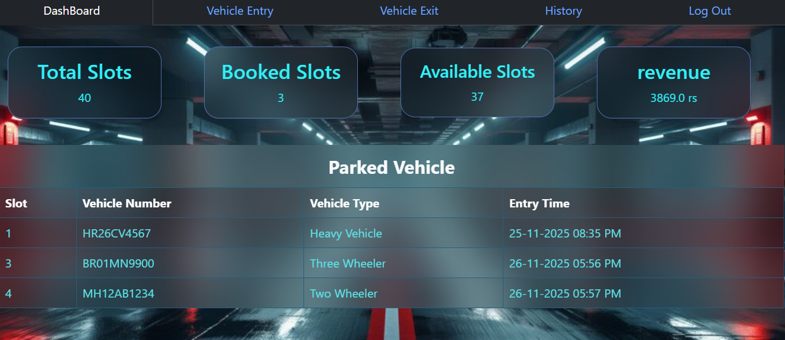
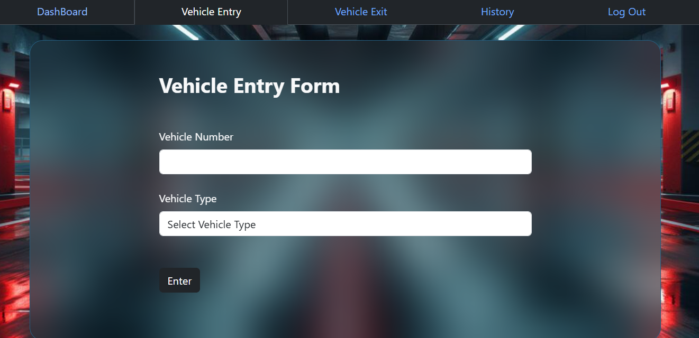
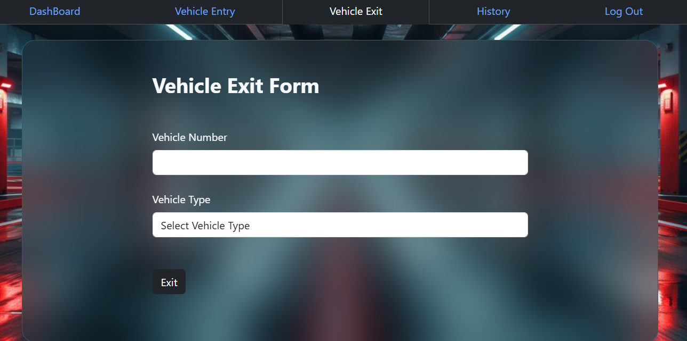
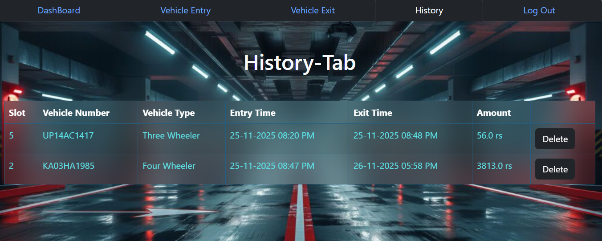
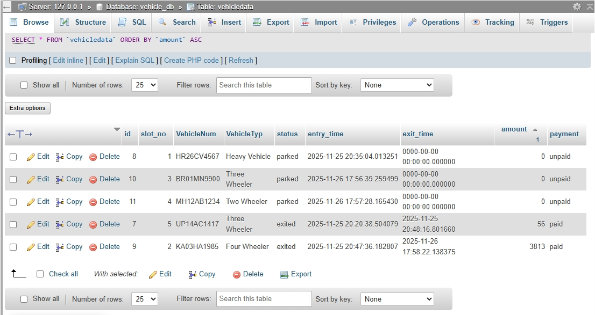

# Vehicle_Parking_management_system

# Project Overview
This project is developed as a **Third Year Mini Project** as part of the Bachelor of Computer Applications (BCA) curriculum.
The **Vehicle Parking Management System** is a software application designed to manage and monitor vehicle parking efficiently. It helps in recording vehicle entry and exit, managing parking slots, calculating parking fees, and maintaining parking records digitally.

# Features
* Vehicle entry management
* Vehicle exit management
* Parking slot allocation
* Parking fee calculation
* View parked vehicle records
* Simple and user-friendly interface

# Technologies Used

* Programming Language: Python
* Framework: Flask 
* Database: MySQL / SQLite
* Frontend: HTML, CSS, JavaScript via bootstrap
* Tools: VS Code, XAMPP, GitHub

#  Working of the System

1. Vehicle details are entered at the time of entry.
2. A parking slot is assigned automatically or manually.
3. Entry time is recorded in the system.
4. At the time of exit, exit time is recorded.
5. Parking fee is calculated based on duration.
6. Vehicle record is stored for future reference.

## 🖼️ Screenshots

* Home Page / Dashboard
  

* Vehicle Entry Page
  

* Vehicle Exit Page
  

* Parking Records Page
  

* DataBase
  

## 👩‍💻 Author

**Ananya Singh**
BCA Student, Allahabad University

